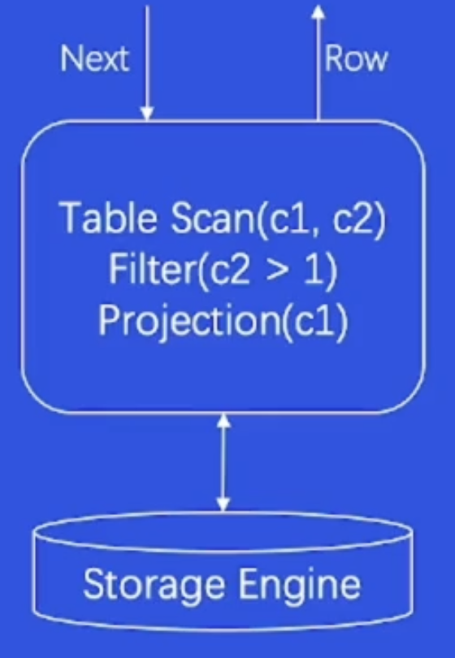

# Database

- [Database](#database)
  - [Data Storage](#data-storage)
    - [Storage System](#storage-system)
    - [Database Classification](#database-classification)
      - [Relational Database](#relational-database)
      - [Non-relational Database](#non-relational-database)
    - [Database VS Traditional Storage System](#database-vs-traditional-storage-system)
  - [Products](#products)
    - [Storage](#storage)
      - [Standalone Storage](#standalone-storage)
      - [Distributed Storage](#distributed-storage)
    - [Database](#database-1)
      - [Standalone Database](#standalone-database)
    - [New Tech](#new-tech)
  - [Relational Database Management System (RDBMS)](#relational-database-management-system-rdbms)
    - [SQL Engine](#sql-engine)
      - [Parser](#parser)
      - [Optimizer](#optimizer)
      - [Executor](#executor)
    - [Storage Engine](#storage-engine)
      - [Buffer Pool](#buffer-pool)
      - [Page](#page)
      - [B+ Tree](#b-tree)
    - [Transaction Engine](#transaction-engine)
    - [Optimization](#optimization)
      - [High Traffic](#high-traffic)
      - [Traffic Surge](#traffic-surge)
      - [Stability and Reliability](#stability-and-reliability)
  - [Tinder Object Storage (TOS)](#tinder-object-storage-tos)
    - [Advantage](#advantage)
    - [Usage](#usage)
  - [Redis](#redis)

## Data Storage

### Storage System

1. The storage system is a software that provides Read/Write & control interfaces and can safely and effectively persist data.

- To meet the Read/Write limitations of the hardware, cache is essential.
- Copy is CPU intensive and should be used as little as possible.

2. Redundant Array of Independent Disks (RAID)

- RAID0: Simple combination of multiple disks improves the bandwidth, but there is no fault-tolerant design.
- RAID1: One disk corresponds to one additional mirror disk, the real space utilization rate is 50%, but the fault tolerance is strong.
- RAID0+1: Combine RAID0 and RAID1, with strong fault tolerance and good write bandwidth.

### Database Classification

#### Relational Database

1. Data Structure: Relational databases use tables to store data, where tables consist of rows and columns, with each column representing an attribute. Data is stored in a structured manner, with data types and relationships defined within pre-defined schemas.
2. Data Consistency: Relational databases emphasize data consistency and integrity. Data follows strict transactions to ensure integrity during data modifications.
3. Query Language: Relational databases utilize SQL (Structured Query Language) for data querying and manipulation. SQL is a powerful standardized query language used for various operations, including data retrieval, insertion, updating, and deletion.
4. Use Cases: They are suitable for scenarios that demand data integrity and consistency, such as finance, e-commerce, management systems, etc.

#### Non-relational Database

1. Data Structure: Non-relational databases adopt more flexible data models, such as key-value pairs, documents, column families, graphs, etc. Data can be semi-structured or unstructured.
2. Data Consistency: Non-relational databases often relax the requirement for strict data consistency, emphasizing availability and partition tolerance. Some provide weak or eventual consistency guarantees.
3. Query Language: Non-relational databases have varying query languages based on the database type, lacking a unified standard. Some offer SQL-like querying languages, while others use APIs.
4. Use Cases: They are suitable for big data, high concurrency, distributed environments, and scenarios requiring flexible data models and scalability, such as social networks, real-time analytics, log processing, etc.

### Database VS Traditional Storage System

Database is a kind of storage system but it has many advantages over traditional storage system.

1. Structured data management.

2. Transaction Capabilities: ACID.

- Atomicity: Atomicity refers to a transaction being the smallest indivisible unit of work. All operations within a transaction are either executed entirely or not at all, avoiding situations where some operations succeed while others fail. If an error occurs during transaction execution, the system rolls back the transaction, restoring the database to its state before the transaction started.
- Consistency: Consistency ensures that the state of the database remains consistent before and after a transaction. During transaction execution, the integrity constraints of the database cannot be violated, meaning that data must satisfy predefined rules such as uniqueness and foreign key constraints.
- Isolation: Isolation means that when multiple transactions are running concurrently, each transaction's operations are isolated from those of other transactions. This ensures that the modifications made by one transaction are not visible to other transactions until the first transaction is committed. Isolation prevents data interference and conflicts between different transactions.
- Durability: Durability ensures that once a transaction is committed, the modifications made by it are permanently saved in the database, even in the event of system crashes or failures. The database system persists the modifications of committed transactions to storage media, ensuring the persistence of data.

3. Complex Query Capability: Domain-Specific Language (DSL)

## Products

### Storage

#### Standalone Storage

1. File System

- Index Node: a data structure used to store metadata about a file or directory. Each file or directory in the file system has a corresponding inode entry, which contains various information about the file but does not include the actual content of the file.
- Directory Entry: a data structure refers to an entry within a directory that associates a file or directory name with its corresponding inode number. It serves as a mapping between the human-readable name of a file or directory and the internal data structure (inode) that contains metadata about that file or directory.

2. Key-Value

- Method: put(key, value) & get(key)
- Data Structure: LSM-Tree (Sacrifice read performance in pursuit of write performance)

#### Distributed Storage

1. HDFS

- Support massive data storage
- High fault tolerance.
- Weak POSIX.

2. Ceph

- Interfaces for objects.
- Master/Standby Replication Model.
- CRUSH algorithm: Hash + Weight + Random Draw

### Database

#### Standalone Database

1. Relational Database: Oracle, MySQL, PostgreSQL.

- Components: Query Engine, Transaction Manager, Lock Manager, Storage Engine, Replication.
- Data Structure: B-Tree, B+-Tree, LRU List.

2. Non-relational Database: MongoDB, Redis, Elasticsearch.

### New Tech

1. Storage Performance Development Kit (SPDK)

- Kernel Space -> User Space: Avoid the performance loss caused by syscall and directly access the disk from user space.
- Interrupt -> Polling: The poller can be bound to the cpu core to reduce the context switch.
- Lock-free queue.

2. AI tech
3. RDMA Network
4. Persistent Memory
5. Programmable Switch

## Relational Database Management System (RDBMS)

### SQL Engine

#### Parser

1. Syntax Analysis: The parser checks whether the input SQL query adheres to the syntax rules of SQL. It identifies keywords, identifiers, operators, etc., and breaks down the query into a hierarchy of syntax elements.

2. Generating Syntax Tree: Based on the syntax analysis, the parser constructs a syntax tree (parse tree). This tree represents the structure and relationships of the query and is used for further processing.

3. Error Checking and Reporting: If the input SQL statement contains syntax errors, the parser detects them and generates corresponding error reports, indicating which parts are erroneous and possible corrective actions.

4. Identifier Resolution: The parser resolves identifiers such as table names and column names into corresponding objects. This involves retrieving information from the database's metadata.

5. Preprocessing: Some database systems support the use of pre-processors in SQL queries. The parser can perform preprocessing steps like macro expansion, variable substitution, etc.

#### Optimizer

1. Rule Base Optimizer (RBO)

- Simplify query conditions.
- Start from small table.
- Scan priority: unique index -> normal index -> full table scan

2. Cost Base Optimizer (CBO)

- Usually time is used as a measure of cost.
- IO, CUP, NET, Memory can also be used as measures of cost.

#### Executor

1. Volcano Model

- Each operator has input and output streams, and data flows from one operator to the next, ultimately generating the query result. The entire process mimics the flow of lava down a volcano, with data moving downward through layers of operations.

- The strength of the Volcano Model lies in its intuitive representation of the query execution process, aiding developers and optimizers in better understanding and optimizing query plans. By decomposing the query execution into multiple operators, the model also offers opportunities for query optimization, such as reordering operators to reduce computation or selecting more suitable join methods.

- The disadvantage is that each calculation of a piece of data has multiple function calls, resulting in low cpu efficiency.

2. Vectorized Model

- Each operation is for a batch (N lines) of data: the number of function calls is decreased to 1/N.
- Provide Single Instruction Multi Data (SIMD) to CPU.

3. Compiled Execution

- All operations are encapsulated into a function, and the cost of function calls is greatly reduced.
- LLVM is used.

### Storage Engine

Take MySQL InnoDB as an example.

#### Buffer Pool

- Find the block from the hash bucket corresponding to the HashMap<page_id, block\*> through the page id.

- Memory Erasure: LRU

#### Page

The smallest management unit of data is the page.

#### B+ Tree

### Transaction Engine

1. Atomicity & Undo Log: eg insert <-> delete

2. Isolation & Lock

- Read & Read: Share Lock & Share Lock
- Write & Write: Exclusive Lock & Exclusive Lock

3. Isolation & MVCC: R/W are non-blocking to each other.

4. Durability & Redo Log: Write-ahead logging (WAL)

### Optimization

#### High Traffic

1. Sharding:

- Horizontally split data.
- Add Proxy Layer for sharding routing

#### Traffic Surge

1. Expansion: add more servers.

2. Proxy Connection Pool: Pre-cache a certain number of connections.

#### Stability and Reliability

1. 3AZ

- Deployment in three computer rooms.
- Realize read-write separation, sub-database sub-table and traffic scheduling through proxy.
- Real-time monitoring alerts.

2. HA Management

## Tinder Object Storage (TOS)

### Advantage

Compared with Hadoop Distributed File System (HDFS), Tinder Object Storage (TOS) has many advantages:

1. Support massive data.

2. Easy to use

- Provide RESTful HTTP API: GET/HEAD/PUT/DELETE
- Cloud.
- Accessible to videos and pictures.

3. Cheap: capable of grading storage for hot and cold data.

4. Applicable for static and immutable data.

### Usage

1. Create A Bucket.
2. Service Logic

- URL: `{bucket}.xxx.com/{object}`
- CRUD
  | Method | Params | Return Value |
  | :-----| ----: | ----: |
  | PUT | Bucket, Key, Content | Success/Fail |
  | GET | Bucket, Key | Content |
  | HEAD | Bucket, Key | MetaData |
  | DELETE | Bucket, Key | Success/Fail |

## Redis

- Turn to [Redis](/database/Redis/)
