# Framework

- [Framework](#framework)
  - [ORM](#orm)
    - [Gorm](#gorm)
  - [RPC](#rpc)
    - [Layers (From top to bottom)](#layers-from-top-to-bottom)
      - [Application Layer](#application-layer)
      - [Encoding Layer](#encoding-layer)
      - [Transport Protocol Layer](#transport-protocol-layer)
      - [Transport Layer](#transport-layer)
    - [Performance](#performance)
    - [Kitex](#kitex)
      - [Structure](#structure)
      - [Scalability](#scalability)
      - [Optimization](#optimization)
        - [Network Library](#network-library)
        - [Encoding](#encoding)
  - [HTTP](#http)
    - [Content](#content)
      - [Request](#request)
      - [Response](#response)
    - [Process](#process)
    - [Layers (From top to bottom)](#layers-from-top-to-bottom-1)
      - [Application Layer](#application-layer-1)
      - [Middleware Layer](#middleware-layer)
      - [Routing Layer](#routing-layer)
      - [Protocol Layer](#protocol-layer)
      - [Transport Layer](#transport-layer-1)
    - [Hertz](#hertz)
  - [Example](#example)

## ORM

- Object–relational mapping (ORM) is a programming technique for converting data between a relational database and the heap of an object-oriented programming language (Wikipedia), like Mybatis in java.
- Using ORM, we can associate a data table in database with a certain class/struct, and by modifying the class/struct instance, we can easily CRUD the database without using SQL statements.

### Gorm

- Turn to [Gorm](/framework/GORM/)

## RPC

- Remote Procedure Call(RPC) is a software communication protocol that one program can use to request a service from a program located in another computer on a network without having to understand the network's details.

<p align="center">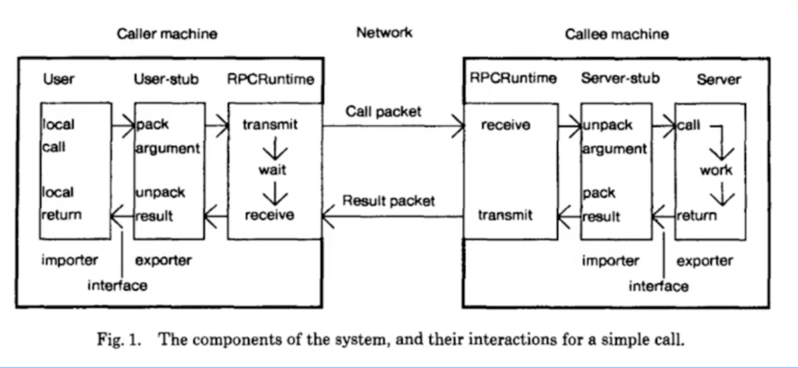</p>

- RPC Process:

<p align="center">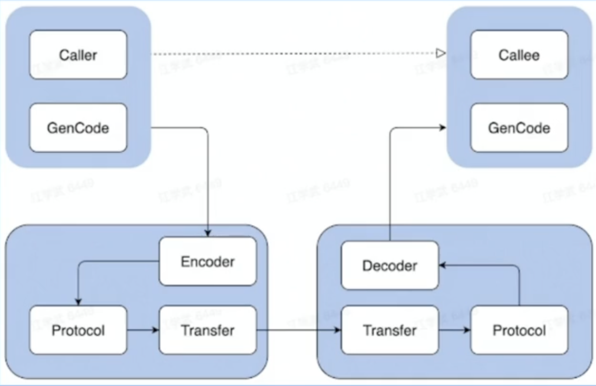</p>

### Layers (From top to bottom)

#### Application Layer

In the application layer, client programs request services by invoking functions on remote servers, which respond by executing the requested operations and returning results to the client. The application layer also addresses higher-level concerns such as authentication, authorization, and error handling.

#### Encoding Layer

The encoding layer is responsible for converting function calls, parameters, and results into formats suitable for transmission over the network, as well as converting received data back into the format required for local invocation. This layer involves data serialization and deserialization to ensure that data can be properly parsed and processed during network transmission.

<p align="center">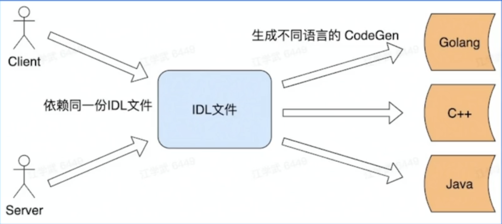</p>

- Type–length–value (TLV)

```go
struct Person{
  1: required string       userName,
  2: optional int64        interestNumber,
  3: optional []string     interests,
}
```

<p align="center">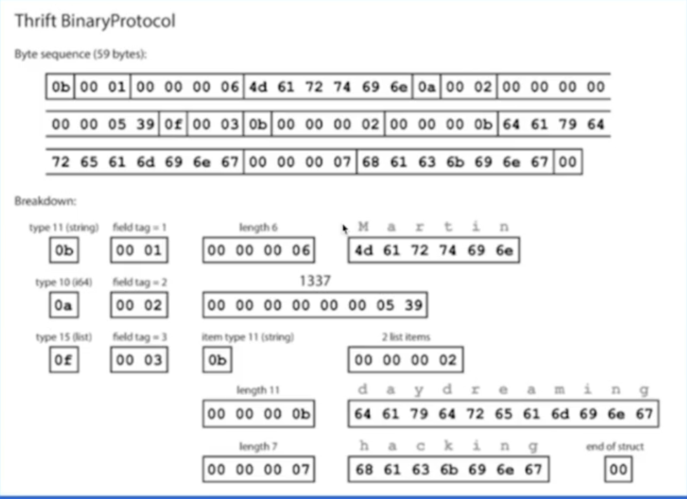</p>

#### Transport Protocol Layer

At this layer, an appropriate transport protocol is chosen to ensure reliable data transmission, including error detection and recovery mechanisms. Common transport protocols include HTTP (Hypertext Transfer Protocol) and specific RPC protocols like gRPC.

<p align="center">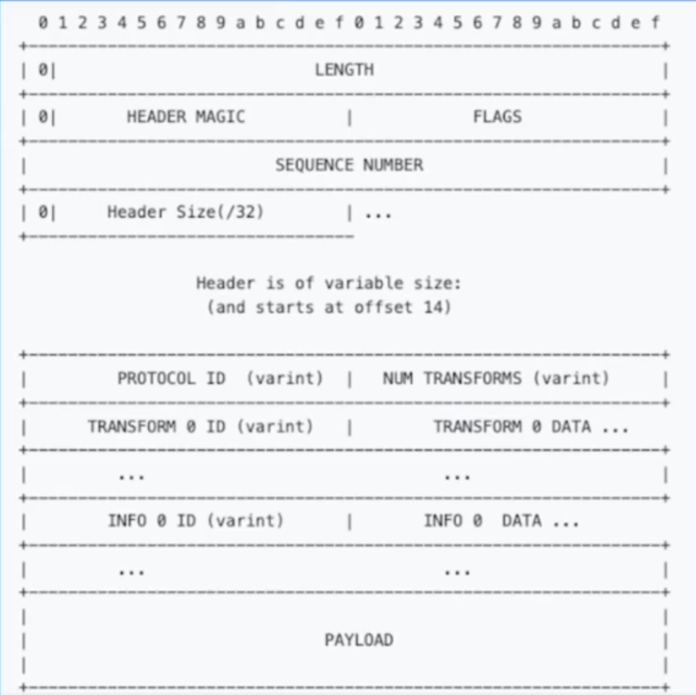</p>

1. Special Fields

- Terminator: eg, Message + \r\n + Message + \r\n

- Variable Length: eg, Length + Message Body + Length + Message Body

2. Process

Peek -> Magic Number (To know which protocol is used) -> Peek -> PayloadCodeC (To know encode method) -> Peek -> Payload

#### Transport Layer

This is the bottommost layer responsible for handling the details of data transmission over the network, such as packet segmentation, sending, and receiving. It provides the underlying network connection and communication mechanisms. Common protocols at this layer include TCP (Transmission Control Protocol) and UDP (User Datagram Protocol).

<p align="center">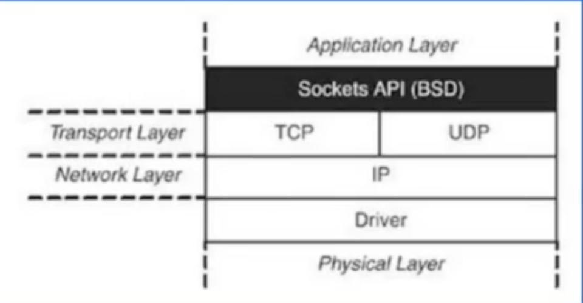</p>

<p align="center">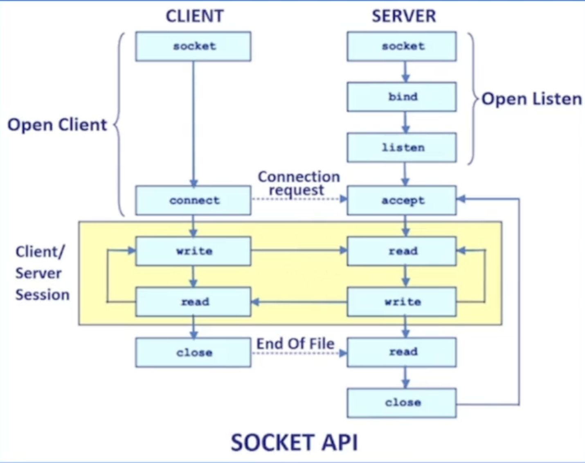</p>

### Performance

1. Stability

- Timeout: Avoid wastes on unavailable nodes.
- Rate Limiter: Protect the callee and prevent the server from being overwhelmed by heavy traffic.
- Circuit Breaker: Protect the callee and prevent the problem of the server from affecting the entire link.
- Request Success Rate: Load balancing and Retry.
- Long Tail Request: Backup Request.

<p align="center">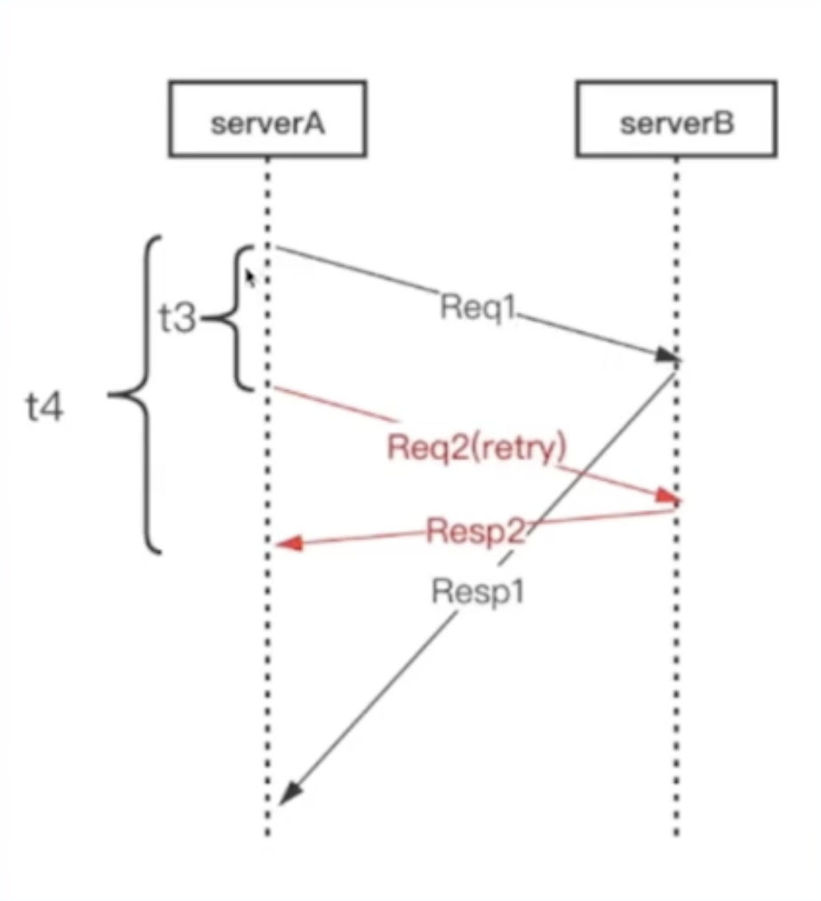</p>

Note: Stability indicators are usually implemented through middleware, eg, WithTimeout(), withRetry().

2. Usability

3. Scalability

<p align="center">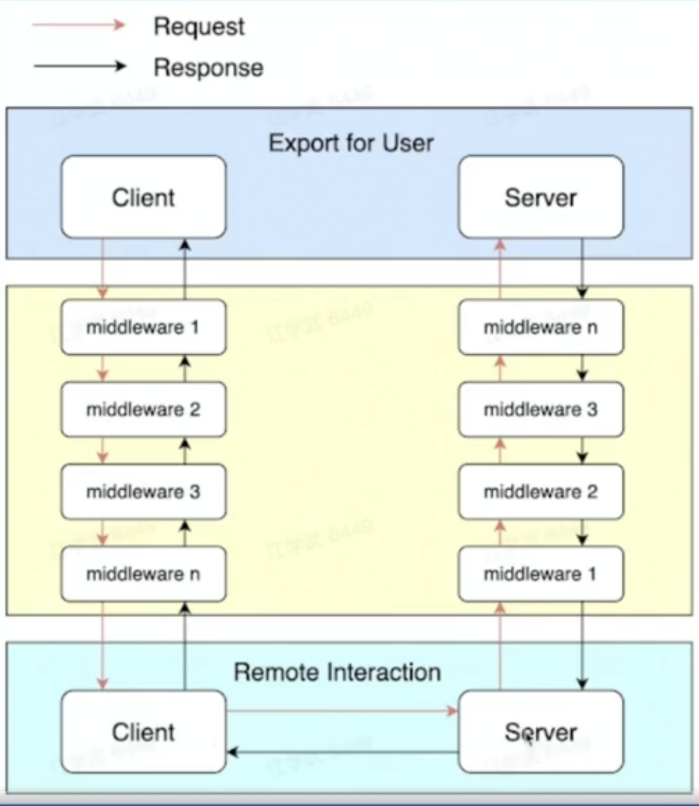</p>

4. Observability

- Log
- Metric
- Tracing

5. Others

- High Throughput: Connection Pool
- Low Latency: Multiplexing

### Kitex

- Turn to [Kitex](/framework/KITEX/)

#### Structure

<p align="center">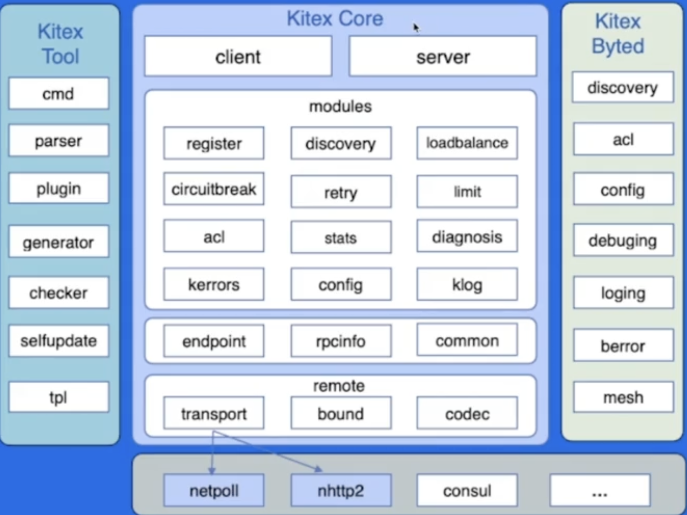</p>

#### Scalability

1. Interaction: Png-Pong / Streaming / Oneway
2. Codec: Thrift / Protobuf
3. Application Layer Protocol: TTHeader / HTTP2
4. Transport Layer: TCP

#### Optimization

##### Network Library

1. Scheduling: epoll_wait, Reuse goroutines.
2. LinkBuffer: Nocopy Buffer.
3. Pool: Object Pool, Memory Pool.

##### Encoding

1. Codegen: Pre-allocated memory, Inline operation, Thrift IDL encoding.
2. JIT (Just-In-Time compilation): Frugal.

## HTTP

### Content

#### Request

1. Request Line

- Methods: GET, HEAD, POST, PUT, DELETE, CONNECT, OPTIONS, TRACE, PATCH
- URL
- Protocol Version

2. Header Fields
3. Message Body

#### Response

1. State Line

- Protocol Version
- State Code
<p align="center">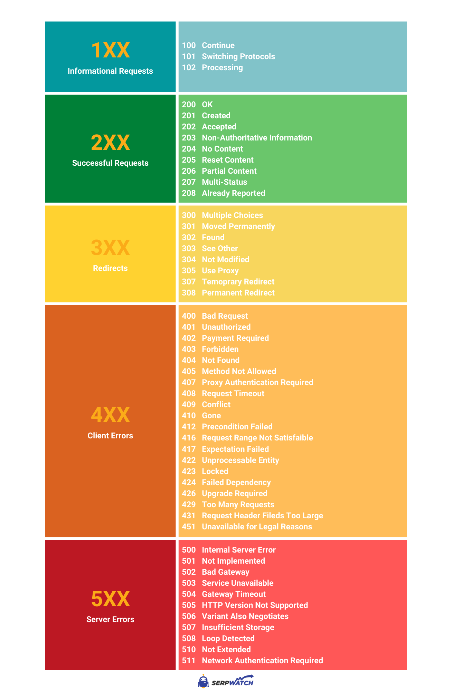</p>

- State Description

1. Header Fields
2. Response Body

```go
h := server.Default()
h.GET("/ping", func(c context.Context, ctx *app.RequestContext) {
	ctx.Data(200, "text/plain; charset=utf-8", []byte("OK"))
})
h.Spin()
```

### Process

<p align="center">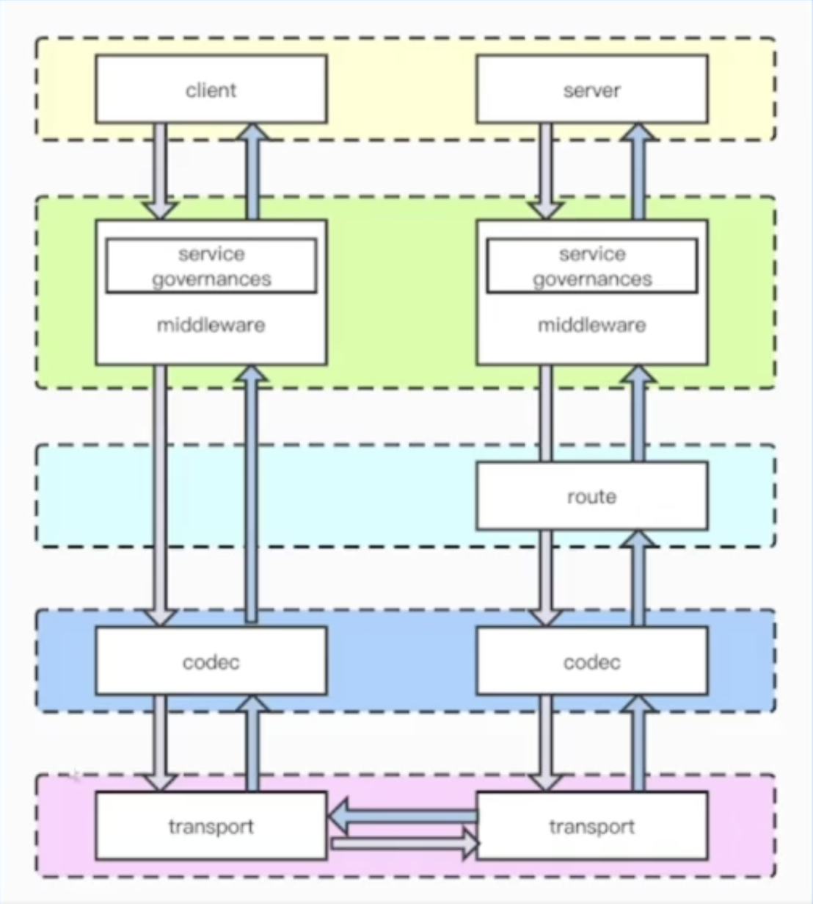</p>

### Layers (From top to bottom)

<p align="center">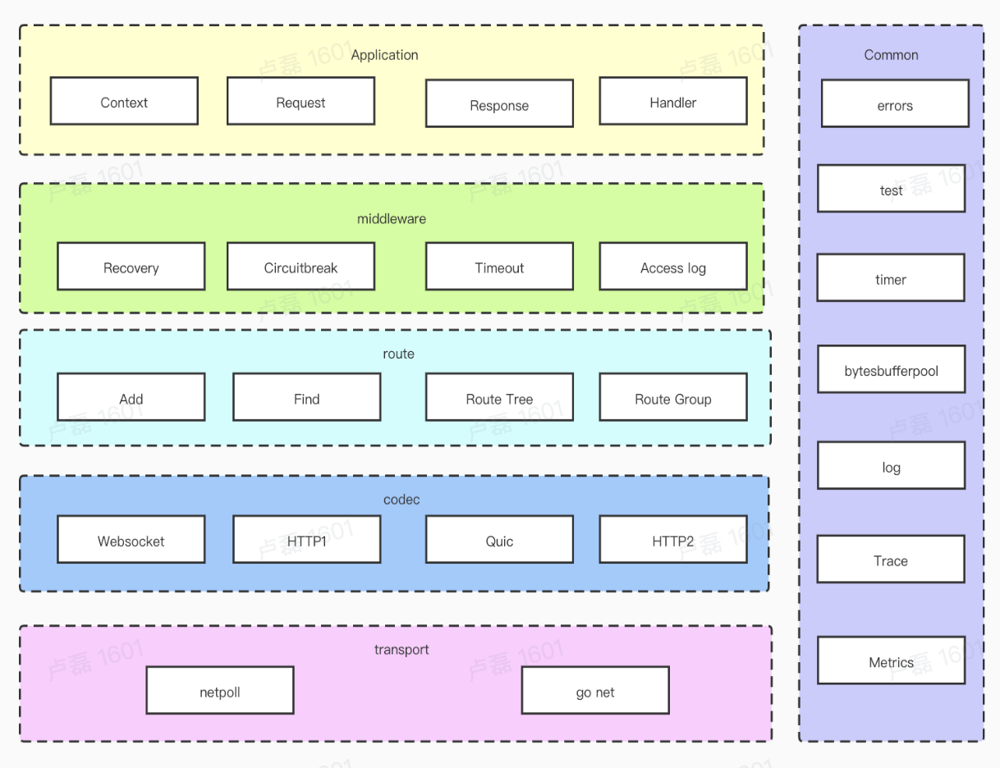</p>

#### Application Layer

Application Layer provides APIs, eg ctx.Request.Header.Peek(key) -> API ctx.GetHeader(key).

#### Middleware Layer

1. With pre-handle logic and post-handle logic.

```go
func Middleware(params){
  // pre-handle logic

  Next() // nextMiddleware() or bizLogic()

  // after-handle logic
}
```

2. Next()

- Without Next(): Initialization logic AND does not need to be on the same call stack.
- With Next(): Post-handle logic OR need to be in the same call stack

3. Routing can register multiple middleware.

4. Guaranteed to increment index at all times.

```go
func (ctx *RequestContext) Next(){
  ctx.index++
  for ctx.index < int8(len(ctx.handler)){
    ctx.handlers[ctx.index]()
    ctx.index++
  }
}
```

5. Exception handler

```go
func (ctx *RequestContext) Abort(){
  ctx.index = IndexMax
}
```

#### Routing Layer

1. Trie

<p align="center">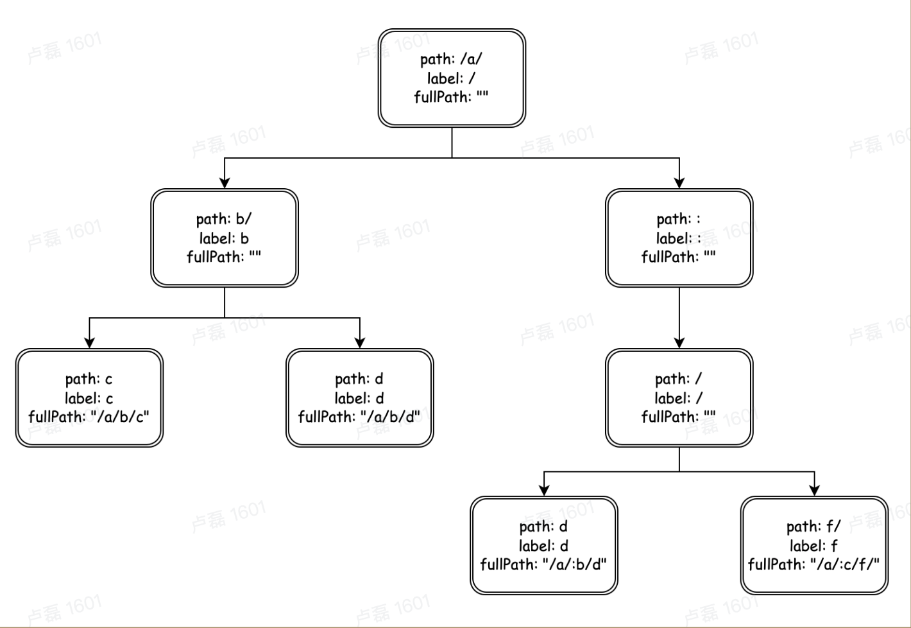</p>

2. Method matching: Map + Method(string) + Tries + Header Node(\*node)

3. Multi-handler: add a list for each handler
  
```go
node struct {
  prefix   string
  parent   *node
  children children
  handlers app.HandlersChain
  ...
}
```

#### Protocol Layer

#### Transport Layer

### Hertz

- Turn to [Hertz](/framework/HERTZ/)

## Example

- https://github.com/cloudwego/biz-demo/tree/main/easy_note
