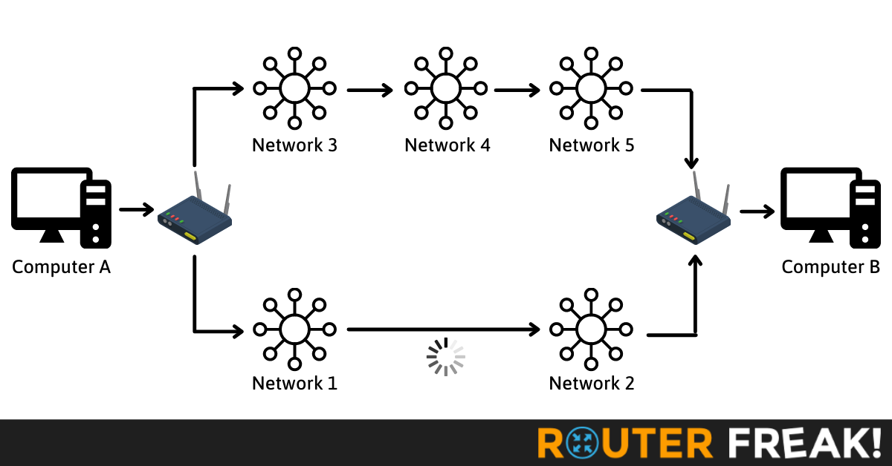
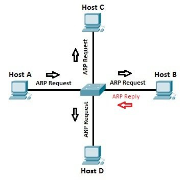
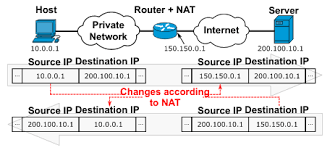
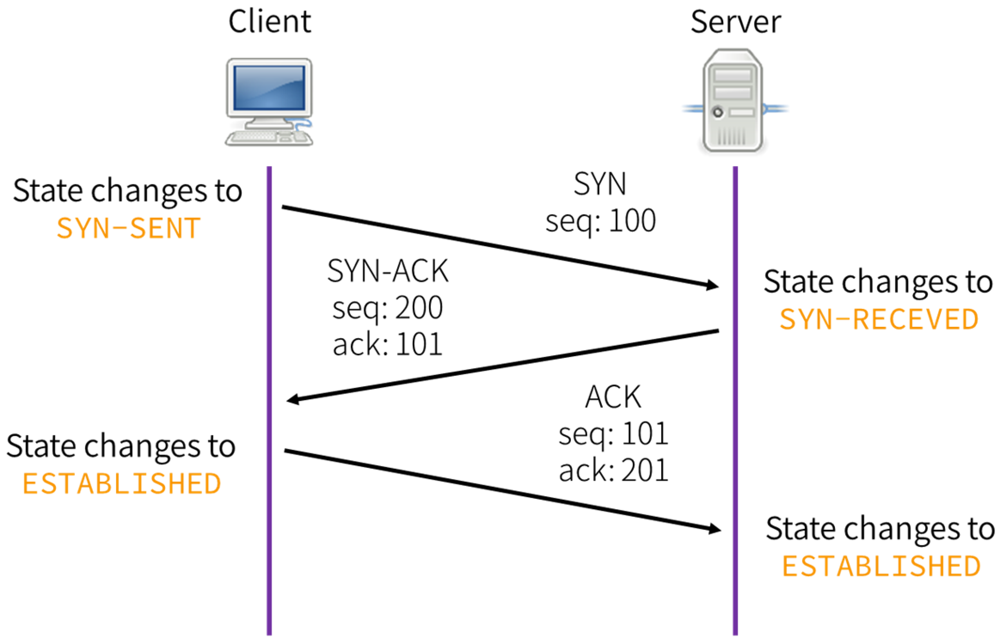
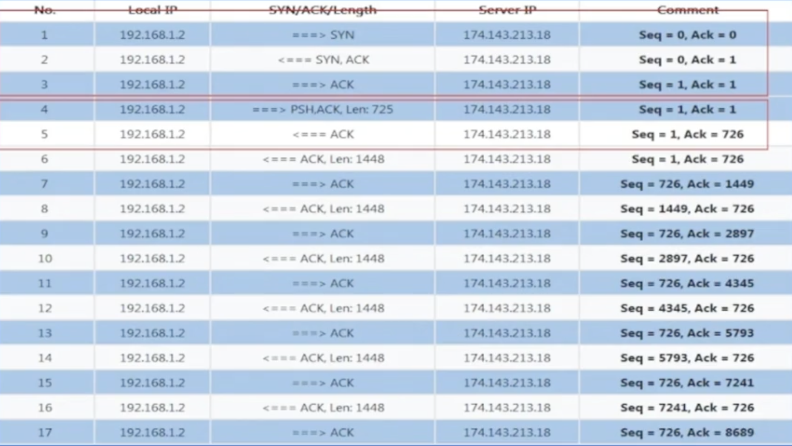
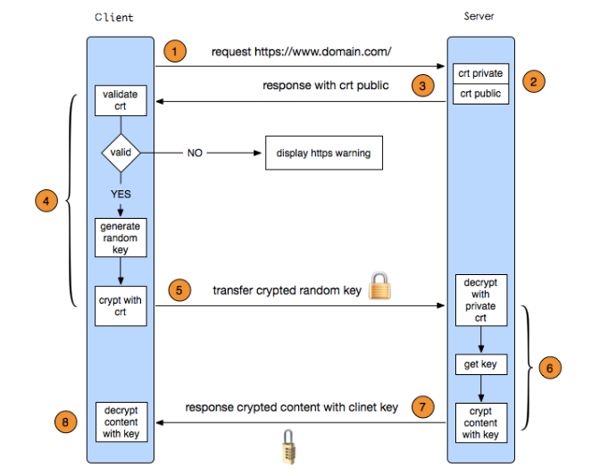

# Network

- [Network](#network)
  - [Network Access](#network-access)
    - [Routing](#routing)
    - [Address Resolution Protocol (ARP)](#address-resolution-protocol-arp)
    - [Internet Protocol (IP)](#internet-protocol-ip)
    - [Network Address Translation (NAT)](#network-address-translation-nat)
  - [Network Transmission](#network-transmission)
    - [Open Systems Interconnection (OSI)](#open-systems-interconnection-osi)
    - [Domain Name System (DNS)](#domain-name-system-dns)
    - [TCP Connection](#tcp-connection)
      - [Three-way Handshake](#three-way-handshake)
      - [TCP Transmission](#tcp-transmission)
    - [HTTP](#http)
      - [HTTP1.1](#http11)
      - [HTTPS](#https)
  - [Network Optimization](#network-optimization)
    - [Acceleration](#acceleration)
    - [Stability](#stability)

## Network Access

### Routing

<p align="center"></p>

1. Routing does not have to be symmetrical.

2. Routing works at Layer 3 (Network Layer).

3. Routing is to change the mac address to find the packet sending port.

```go
func send_one_pkt(){
    rt = find_rt(dst)  // including host egress network port and next_hop
    ...
    l2->dst_mac = rt->next_hop->mac // change mac
    p = append(p, l2)
    ...
    send(p, rt->port) // Specify when sending
}
```

4. Dynamic Routing: BGP / OSPF

### Address Resolution Protocol (ARP)

<p align="center"></p>

1. ARP is to look up the mac address of the next hop.
2. Only devices within the same network segment can send ARP.
3. ARP requests are broadcasted, while ARP replies are unicast.
4. Gratuitous ARP: an ARP message in computer networking where a host sends an ARP request with its own IP address as the target IP address.

- Address Conflict Detection: A device can send a gratuitous ARP to check if another device is using its IP address. If it receives a response, it indicates an IP address conflict.
- Updating ARP Caches: Gratuitous ARPs can help update the ARP caches of other devices on the same network segment, ensuring they have the latest MAC address associated with the IP address.
- Failover and Redundancy: In case of a failover or a change in network configuration, a device might send a gratuitous ARP to inform other devices of its new MAC address.
- Network Reconfiguration: After a network configuration change (like subnet change), devices can send gratuitous ARPs to inform others about the new network setup.

5. ARP Proxy: a mechanism designed to solve ARP resolution challenges when communication spans different subnets or networks. It acts as a proxy for handling ARP requests and replies, enabling communication across subnet boundaries.

### Internet Protocol (IP)

<p align="center"></p>

1. The IP protocol is used to unify different types of Layer 2 network protocols.

2. IPV4 / IPV6

### Network Address Translation (NAT)

<p align="center"></p>

1. NAT works by mapping private IP addresses within the local network to one or more public IP addresses. This allows multiple devices in the local network to communicate with the external internet using a single public IP address. When a packet is sent from a device within the local network to the external network, NAT replaces the source IP address with the public IP address of the NAT device. When response packets return, NAT uses its mapping table to convert the destination IP address back to the private IP address of the source device.

2. Different types:

- Static NAT: One-to-one mapping, where a private IP address is mapped to a single public IP address.
- Dynamic NAT: One-to-many mapping, where multiple private IP addresses are mapped to a pool of public IP addresses, but the mappings are temporary and may change with each use.
- PAT (Port Address Translation): One-to-many mapping that uses different port numbers to distinguish between different internal devices, in addition to mapping private IP addresses to a public IP address.

3. NAT allows multiple devices to share the same public IP address under limited availability of public IP address resources, thereby enhancing the utilization of IPv4 addresses. However, NAT can introduce certain networking issues, such as not being suitable for certain applications and protocols, and potentially adding complexity to the network.

## Network Transmission

### Open Systems Interconnection (OSI)

<p align="center"></p>

### Domain Name System (DNS)

<p align="center"></p>

1. The DNS is responsible for translating human-readable domain names (like www.example.com) into computer-understandable IP addresses (such as 192.0.2.1). This translation allows us to use easily memorable domain names to access various resources on the internet without needing to remember complex numeric IP addresses.

2. The main functions of DNS include:

- Domain Name Resolution: Converting the domain name entered by a user into the corresponding IP address. When you type a domain name in a web browser, DNS helps you find the associated IP address so that the browser can connect to the correct server.

- Domain Name Forwarding: DNS servers can forward requests to other DNS servers to obtain the information needed for domain name resolution. This aids in information retrieval in distributed systems.

- Domain Name Caching: To enhance performance and reduce network traffic, DNS servers cache resolved domain name-to-IP address mappings. This way, when multiple users request the same domain name, DNS can return the result directly from the cache without needing to perform resolution every time.

- Reverse Resolution: Converting an IP address into a domain name. This is useful in certain cases, such as determining the domain name associated with a given IP address.

3. Take www.example.com as an example:

- Local DNS Query: Your computer or router's local DNS server is the first to be queried. If this local server already has the IP address of "www.example.com" cached, it provides the result directly.

- Local DNS Cache Miss: If the local server doesn't have the IP address cached, it sends a query to your Internet Service Provider's (ISP) DNS server.

- Root Domain Server Query: The ISP's DNS server queries the root domain servers, asking for the IP address of the ".com" domain server.

- .com Domain Server Query: The root domain servers direct the ISP's DNS server to query the ".com" domain server for the IP address of the "example.com" domain server.

- example.com Domain Server Query: The ".com" domain server tells the ISP's DNS server the IP address of the "example.com" domain server.

- Authoritative Server Query: The ISP's DNS server queries the "example.com" domain server for the IP address of "www.example.com."

- example.com Domain Server Response: The authoritative domain server for "example.com" responds with the actual IP address of "www.example.com" to the ISP's DNS server.

- Final Resolution: The ISP's DNS server returns the obtained IP address to your local DNS server, and finally, your local DNS server provides the IP address to your computer. This enables your browser to connect to the server associated with "www.example.com."

4. DNS operates based on UDP (User Datagram Protocol).

- Efficiency: UDP is connectionless, which means there is no need to establish a connection before sending data.
- Lightweight: UDP headers are smaller, consuming less bandwidth. This is crucial for domain name resolution, as there are numerous DNS queries on the internet.
- Stateless: UDP being connectionless, it doesn't maintain connection state information. This allows DNS servers to handle multiple query requests simultaneously without managing complex connection states.
- DNS implements its own mechanisms at the application layer, like retry mechanisms and timeout mechanisms, to ensure query accuracy and reliability.

### TCP Connection

#### Three-way Handshake

<p align="center"></p>

1. Step 1 - SYN (Synchronize) from Client: The client initiates the handshake by sending a TCP packet with the SYN flag (SYN packet) set to the server. This packet indicates that the client wants to establish a connection. The client also selects an initial sequence number (ISN) that will be used for the data segments.

2. Step 2 - SYN-ACK (Synchronize-Acknowledge) from Server: Upon receiving the SYN packet, the server responds with a TCP packet containing both the SYN and ACK (acknowledge) flags set (SYN-ACK packet). The server acknowledges the client's request and sends its own initial sequence number (ISN) for data segments.

3. Step 3 - ACK from Client: Finally, the client responds with an ACK packet. This packet acknowledges the server's initial sequence number (ISN) and confirms the connection establishment. The data transmission can now begin.

#### TCP Transmission

1. Seq & Ack

- Sequence Number: The Sequence Number is a field within the TCP segment that identifies each byte in the byte stream sent by the sender. It indicates the position of the next byte the sender plans to transmit. As data is sent, each byte is assigned a sequence number to ensure proper reassembly at the receiving end.

- Acknowledgment Number: The Acknowledgment Number is another field within the TCP segment, representing the sequence number the receiver of the data expects to receive next. In TCP communication, the receiver informs the sender of the sequence number it expects to receive after a specific byte. The acknowledgment number indicates the next data byte the receiver is expecting.

<p align="center"></p>

2. TCP State Machine

<p align="center"></p>

- Closed: This is the initial state of a TCP connection. No connection exists, and neither side is prepared for data exchange.

- Listen: The server is listening for incoming connection requests from clients.

- Syn Sent: The client initiates a connection by sending a SYN packet to the server, indicating its intent to establish a connection.

- Syn Received: The server responds to the client's SYN packet with its own SYN packet and acknowledges the client's SYN (SYN-ACK). The server is now ready to receive data.

- Established: Both sides have exchanged SYN packets, and the connection is established. Data can now be exchanged bidirectionally.

- Fin Wait 1: The active party (either client or server) initiates the termination by sending a FIN packet to signal that it has finished sending data.

- Closing: Both sides have initiated termination. The active closer enters the Closing state, waiting for the peer's acknowledgment of its FIN.

- Time Wait: The side that initiates the termination enters the Time Wait state after sending a FIN. This state is to ensure that any delayed packets related to the closed connection are not confused with new connections.

- Last Ack: The passive closer (the side that received the FIN first) transitions to this state after acknowledging the peer's FIN.

- Closed (again): After both sides have exchanged FIN packets and acknowledged each other's FINs, the connection is fully closed, and both sides return to the Closed state.

3. Timewait: TIME_WAIT state occurs after a TCP connection is closed, where the active closer (the side that sent the FIN) waits for a period of time to ensure that all packets associated with the connection have been properly processed by the passive closer (the side that received the FIN).

4. Lost packets:

- Sequence Numbers and Acknowledgments: TCP assigns sequence numbers to every byte of data it sends. The receiver acknowledges the receipt of these bytes by sending back an acknowledgment (ACK) with the next expected sequence number. If a sender doesn't receive an acknowledgment for a certain packet, it assumes the packet was lost and retransmits it.

- Retransmission: If a sender doesn't receive an acknowledgment for a packet within a certain timeout period, it assumes the packet was lost and retransmits it. The receiver, upon receiving a duplicate packet, discards the duplicate and acknowledges the original packet it had received.

- Selective Retransmission: TCP doesn't retransmit all lost packets; instead, it uses a selective retransmission mechanism. If a receiver detects a gap in the sequence numbers (indicating a lost packet), it requests the sender to retransmit only the missing packets, not the entire sequence of data.

- Sliding Window: TCP uses a sliding window mechanism to manage the flow of data. This window indicates how much data can be sent without waiting for an acknowledgment. If an acknowledgment is not received for a window of data, the sender retransmits the unacknowledged portion.

- Timeout Management: TCP employs dynamic timeout mechanisms. The timeout duration is adjusted based on network conditions. If acknowledgments are not received within the expected timeout window, the sender assumes packet loss and initiates retransmission.

- Fast Retransmit and Recovery: TCP's fast retransmit and recovery mechanisms allow the sender to retransmit lost packets without waiting for the timeout to expire. If a sender receives multiple duplicate acknowledgments (indicating the receiver expects a missing packet), it quickly retransmits the suspected lost packet.

- Congestion Control: TCP's congestion control mechanisms help prevent network congestion that can lead to packet loss. If a sender detects congestion (e.g., due to a high volume of lost packets), it reduces its sending rate to alleviate network congestion.

### HTTP

Hypertext Transfer Protocol (HTTP) relies on the underlying TCP protocol to achieve data transmission. The HTTP protocol defines the rules and formats for communication over TCP connections, making it more convenient for developers to build network-based applications.

#### HTTP1.1

Optimizations on HTTP1.1:

- Persistent Connections: In HTTP/1.0, each HTTP request/response pair required a separate TCP connection. HTTP/1.1 introduced persistent connections, allowing multiple requests and responses to be sent and received over the same TCP connection. This reduces the overhead of establishing and tearing down connections for each request.

- Pipeline Requests: HTTP/1.1 supports pipelining, which allows the client to send multiple requests to the server without waiting for individual responses. This helps in utilizing the full capacity of the TCP connection and reducing latency.

- Host Header: HTTP/1.1 mandates the use of the "Host" header in requests. This header allows multiple websites to be hosted on the same IP address and port, as the server can differentiate between them based on the Host header.

- Chunked Transfer Encoding: HTTP/1.1 introduced the chunked transfer encoding mechanism. This allows the server to send the response in smaller chunks, which can be beneficial for streaming or large responses.

- Content Negotiation: HTTP/1.1 improved content negotiation, allowing clients and servers to negotiate the format and language of the response content. This enables better customization of content for different devices and user preferences.

- Caching Improvements: HTTP/1.1 includes enhanced caching mechanisms, such as the "Cache-Control" header, which gives more control over caching behavior. This helps in reducing unnecessary data transfer and improving performance.

- Range Requests: HTTP/1.1 introduced support for range requests, allowing clients to request only a portion of a resource instead of the entire resource. This is useful for resuming interrupted downloads and optimizing bandwidth usage.

- Connection Management: HTTP/1.1 includes the "Connection" header, which allows clients and servers to specify whether a connection should be kept open after a response is sent. This gives more control over connection management.

- Keep-Alive Mechanism: HTTP/1.1's keep-alive mechanism allows a persistent connection to remain open for a certain period of time after a response is received. This reduces the need to reopen connections for subsequent requests.

- Header Compression: Although not a built-in feature of HTTP/1.1, some implementations use header compression techniques like "gzip" to reduce the size of headers and improve data transfer efficiency.

#### HTTPS

Hypertext Transfer Protocol Secure (HTTPS) uses SSL (Secure Sockets Layer) and its successor TLS (Transport Layer Security) to achieve encryption and security.

<p align="center"></p>

## Network Optimization

### Acceleration

1. Multiplexing Stream : HTTP2.0
2. QUIC : HTTP3.0
3. Access within the same carrier.
4. Content Delivery Network (CDN)
5. Dynamic API Path Optimization

### Stability

1. Network Resilience

- Dedicated Line First
- Eliminating Unavailable Data Centers
- Cloud Server
- Cache

2. Troubleshooting

- dig
- ping/telnet/nmap
- Traceroute
- iptabels
- tcpdump
